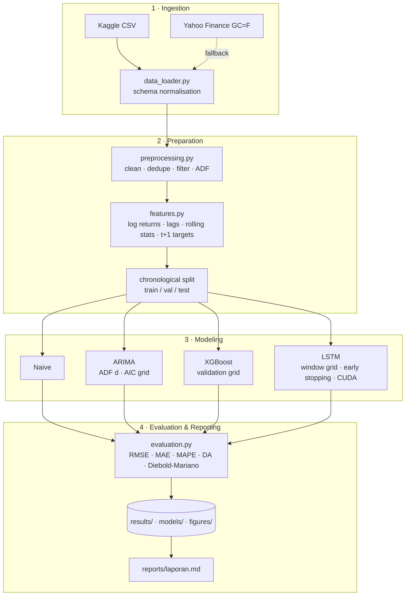

# Gold Price Forecasting: ARIMA vs XGBoost vs LSTM

> Next-trading-day forecasting of gold (XAU/USD) closing prices. The project compares a naive random walk, ARIMA,
> XGBoost and an LSTM on the same chronologically held-out test period, with significance testing, on laptop-class
> hardware (RTX 4050, 6 GB).


---

## Table of Contents

1. [Overview](#overview)
2. [Research Question](#research-question)
3. [Dataset](#dataset)
4. [System Architecture](#system-architecture)
5. [Directory Structure](#directory-structure)
6. [Methodology](#methodology)
7. [Getting Started](#getting-started)
8. [Usage](#usage)
9. [Results](#results)
10. [Testing](#testing)
11. [Dicoding Submission](#dicoding-submission)
12. [Limitations and Future Work](#limitations-and-future-work)
13. [References](#references)
14. [License and Disclaimer](#license-and-disclaimer)

---

## Overview

Gold is a safe-haven asset, an inflation hedge and a core central-bank reserve. Short-horizon price forecasts support
hedging, treasury and risk-management decisions. They also matter in Indonesia, where domestic bullion prices follow
XAU/USD converted to rupiah.

This repository contains:

- a **self-contained, fully documented notebook** that covers domain, business understanding, EDA, preparation,
  modeling and evaluation (the Dicoding deliverable);
- a **modular, unit-tested Python package** (`src/`) that implements the same methodology as a CLI pipeline;
- a **project report in Indonesian** (`reports/laporan.md`) that follows the Dicoding template and covers all additional rubric criteria;
- English **technical documentation** (`docs/`).

| | |
|---|---|
| **Task** | Univariate time-series forecasting (regression), horizon = 1 trading day |
| **Target** | `Close[t+1]` (USD per troy ounce) |
| **Models** | Naive random walk · ARIMA · XGBoost · LSTM (PyTorch) |
| **Metrics** | RMSE (primary) · MAE · MAPE · Directional accuracy · Diebold-Mariano test · runtime |
| **Split** | Chronological 80 % train / 10 % validation / 10 % test |

## Research Question

The literature disagrees. Siami-Namini & Namin (2018) and Fischer & Krauss (2018) report large gains for LSTM
on financial series. Makridakis et al. (2018), using 1,045 M3 series, find that statistical methods beat ML methods in
accuracy at a fraction of the compute cost. This project tests the question on one concrete asset:

> **Does the extra complexity of machine-learning (XGBoost) and deep-learning (LSTM) models deliver a statistically
> significant improvement over a naive random walk and ARIMA when forecasting next-day gold prices?**

## Dataset

| Property | Value |
|---|---|
| Name | [Gold Price Master Dataset (2015–2026) XAU/USD](https://www.kaggle.com/datasets/aminasalamt/gold-price-master-dataset-2015-2026-lxauusd) |
| Origin | Yahoo Finance via `yfinance` |
| Granularity | Daily trading days, 2015-01-02 – 2026-04-29 (2,847 rows × 6 columns) |
| Columns | `Date, Open, High, Low, Close, Volume` |
| Fallback | `scripts/download_data.py` (Yahoo `GC=F`, same period) |
| Licence | Research and education only; raw data is git-ignored and not redistributed |

See [docs/data_dictionary.md](docs/data_dictionary.md) for all raw and engineered variables.

## System Architecture



**Design principles**

- **No look-ahead.** Features at origin `t` use only data up to `t`, and the splits are time-ordered. Scalers and ARIMA
  parameters are fitted on training data only, and the test set is scored once. A unit test perturbs future prices and
  asserts that past features stay the same.
- **Return-space learning.** Gold traded above its training-period maximum during the test window. Tree models and
  scaled-price networks cannot extrapolate beyond that range, so XGBoost and LSTM predict log returns, which are then
  converted back to prices.
- **Model-agnostic evaluation.** Every forecaster exposes `predict_close()` aligned to the same test origins.
- **Single source of truth for the notebook.** The percent-format `.py` generates the `.ipynb`, so the two deliverables cannot drift apart.

Full details: [docs/architecture.md](docs/architecture.md).

## Directory Structure

```
gold-price-forecast-arima-lstm/
├── README.md                         Project overview (this file)
├── LICENSE                           MIT licence
├── requirements.txt                  Python dependencies
├── pyproject.toml                    Project metadata, pytest and ruff config
├── .gitignore
│
├── data/
│   ├── README.md                     How to obtain the dataset
│   ├── raw/                          xauusd_daily.csv (git-ignored)
│   └── processed/                    xauusd_clean.csv (generated, git-ignored)
│
├── notebooks/
│   ├── gold_price_forecasting.py     Notebook source, percent format (Dicoding .py deliverable)
│   └── gold_price_forecasting.ipynb  Generated notebook (Dicoding .ipynb deliverable)
│
├── src/                              Modular, tested implementation
│   ├── config.py                     Dataclass configuration (paths, dates, grids)
│   ├── utils.py                      Seeding, device, logging, timing
│   ├── data_loader.py                CSV / Yahoo ingestion and schema normalisation
│   ├── preprocessing.py              Cleaning, quality report, ADF, chronological split
│   ├── features.py                   Leakage-safe features, sliding windows
│   ├── evaluation.py                 Metrics and Diebold-Mariano test
│   ├── visualization.py              EDA and results figures
│   ├── pipeline.py                   CLI orchestration (python -m src.pipeline)
│   └── models/
│       ├── baseline.py               Naive random walk
│       ├── arima.py                  ARIMA order search and one-step forecasts
│       ├── xgboost_model.py          XGBoost on engineered features
│       └── lstm.py                   PyTorch LSTM with early stopping
│
├── scripts/
│   ├── download_data.py              Yahoo Finance fallback download
│   ├── build_notebook.py             .py → .ipynb (optionally executes it)
│   └── make_submission.py            Validates and zips the Dicoding submission
│
├── tests/                            pytest suite (loader, leakage, metrics, models)
│
├── reports/
│   ├── laporan.md                    Project report in Indonesian (Dicoding template)
│   └── figures/                      Figures generated by the notebook
│
├── docs/
│   ├── architecture.md               System architecture and leakage controls
│   ├── methodology.md                Experimental protocol
│   ├── data_dictionary.md            Raw and engineered variables
│   ├── references.md                 IEEE-style bibliography
│   └── submission_guide.md           Dicoding rubric checklist
│
├── models/                           Trained weights (generated, git-ignored)
└── results/                          Metrics, predictions, tuning logs (generated, git-ignored)
```

## Methodology

| Stage | Details |
|---|---|
| **Cleaning** | Parse dates → sort → drop duplicate dates → drop missing or non-positive `Close` → fill missing OHL with `Close`; trading-day gaps kept |
| **Transformation** | `r[t] = ln(Close[t]/Close[t-1])` |
| **Features (22)** | Return lags 0–9; rolling mean and std of returns, and price/SMA ratio (5, 10, 20); high-low range; open-to-close change; weekday |
| **Split** | 80 / 10 / 10 chronological |
| **Naive** | `Close_hat[t+1] = Close[t]` |
| **ARIMA** | log price; `d` from ADF (α = 0.05); `(p, q) ∈ {0..3}²` by AIC; frozen-parameter one-step forecasts |
| **XGBoost** | Target `r[t+1]`; grid `max_depth {2,3,5} × learning_rate {0.01,0.05} × min_child_weight {1,5}`; early stopping on validation |
| **LSTM** | z-scored return windows; grid `window {30,60} × hidden {32,64} × layers {1,2}`; Adam 1e-3, batch 64, dropout 0.2, patience 10 |
| **Selection** | Lowest validation RMSE within each model family; test set used once for the final comparison |
| **Significance** | Diebold-Mariano (HLN-corrected) test of each model against the naive forecast |

Full protocol: [docs/methodology.md](docs/methodology.md).

## Getting Started

### Prerequisites

- Python 3.10+ (tested with 3.12)
- Optional: an NVIDIA GPU with CUDA 12.x for the LSTM (CPU works too)

### Installation

```bash
git clone <your-private-repo-url> gold-price-forecast-arima-lstm
cd gold-price-forecast-arima-lstm
python -m venv .venv
```

Activate the environment (`.venv\Scripts\activate` on Windows, `source .venv/bin/activate` on Linux/macOS). Install PyTorch with CUDA first, then the rest:

```bash
pip install torch --index-url https://download.pytorch.org/whl/cu124
```

```bash
pip install -r requirements.txt
```

Register the environment as a Jupyter kernel so the notebook uses these packages:

```bash
python -m ipykernel install --user --name gold-forecast --display-name "Python (gold-forecast)"
```

### Get the data

Download the Kaggle CSV into `data/raw/xauusd_daily.csv` (see [data/README.md](data/README.md)), or use the fallback:

```bash
python scripts/download_data.py
```

## Usage

### Notebook (recommended: produces the report figures)

```bash
python scripts/build_notebook.py --execute --kernel current
```

Or open `notebooks/gold_price_forecasting.ipynb` in Jupyter or VS Code, select the `gold-forecast` kernel, choose **Run All** and save.

### CLI pipeline

```bash
python -m src.pipeline
```

Useful flags: `--data <csv>`, `--skip-lstm` (fast CPU-only run), `--cpu`, `--start YYYY-MM-DD`, `--end YYYY-MM-DD`.

### Outputs

| Path | Content |
|---|---|
| `results/metrics.csv` | Test RMSE, MAE, MAPE, directional accuracy, runtime and DM p-value per model |
| `results/test_predictions.csv` | Actual vs predicted next-day close per test origin |
| `results/run_summary.json` | Split periods, selected hyperparameters, best model |
| `reports/figures/*.png` | EDA, split, diagnostics, learning curve, feature importance, forecasts, residuals |
| `models/xgboost.json`, `models/lstm.pt` | Trained models |

## Results

Test period: **2025-03-13 to 2026-04-28** (284 trading days; prices USD 2,973.60–5,318.40, entirely above the training
maximum of USD 2,093.10). Source: `results/metrics.csv` from the executed notebook (RTX 4050 Laptop GPU).

Rows are ordered by **validation RMSE**, the model-selection criterion. The test set is only used to report performance.

| Model | Val RMSE | Test RMSE | Test MAE | Test MAPE (%) | Directional Acc. (%) | RMSE vs Naive | DM p-value | Time (s) |
|---|---|---|---|---|---|---|---|---|
| **LSTM (W=30, H=64, L=2), selected** | **24.58** | 75.65 | **49.60** | **1.207** | 56.38 | −0.20 % | 0.338 | 17.34 |
| XGBoost (depth 5, lr 0.05, 30 trees) | 24.67 | **75.55** | 49.76 | 1.209 | **57.45** | −0.35 % | 0.781 | 1.45 |
| ARIMA(0,1,0) | 24.75 | 75.81 | 49.82 | 1.212 | n/a | 0.00 % | 0.979 | 4.27 |
| Naive | 24.75 | 75.81 | 49.82 | 1.212 | n/a | 0.00 % | – | 0.0001 |

**Key findings**

- **No model beats the random walk with statistical significance** (all Diebold-Mariano p-values > 0.05). The
  validation-selected LSTM is only 0.20 % below the naive test RMSE. XGBoost's slightly lower test RMSE is not used for
  selection, since that would bias the result.
- **ARIMA selected (0,1,0)** by AIC, which is exactly a random walk. Adding AR or MA terms did not help, and the
  Ljung-Box tests show no remaining autocorrelation in the residuals.
- **The LSTM only learned the average drift.** It predicted "up" on 100 % of test days, with predicted daily returns of
  0.060 % ± 0.017 %. Its 56.4 % directional accuracy matches the 56.0 % share of up days in the test period.
- **Forecast error equals market noise.** The naive RMSE (75.81) equals the standard deviation of daily USD price
  changes in the test period. Test RMSE is ~3× the validation RMSE because annualised volatility rose from 15.4 %
  to 27.5 % and the price level rose ~1.6×, not because of overfitting.
- **Recommendation:** the naive random walk (equivalently ARIMA(0,1,0)). It is as accurate as the alternatives at no
  computational cost, consistent with weak-form market efficiency and with Makridakis et al. (2018).

## Testing

```bash
python -m pytest
```

The suite covers CSV layout parsing (Kaggle, multi-row yfinance headers, aliases, timezones), cleaning, ordered splits,
**no-look-ahead feature construction**, sliding windows, metric formulas, the Diebold-Mariano test, and smoke tests for
all four models (the LSTM runs on CPU).

## Dicoding Submission

The report is `reports/laporan.md`, written in Indonesian and following the Dicoding template, including all six
additional rubric criteria. Before submitting:

1. Execute the notebook on the real dataset.
2. Replace every `[ISI ...]` placeholder in the report with the notebook's outputs.
3. Run `python scripts/make_submission.py`. It checks the notebook, figures and placeholders, then writes `dist/submission_gold_forecast.zip`.

> ⚠️ Dicoding requires that the project has **not been published on any platform**. Keep this repository **private** until the review is complete.

Full checklist: [docs/submission_guide.md](docs/submission_guide.md).

## Limitations and Future Work

- **Univariate:** no macro drivers yet (US dollar index, real yields, VIX, central-bank purchases).
- **Single hold-out period:** rolling-origin backtesting would give more robust estimates.
- **Point forecasts only:** quantile, conformal or GARCH-type volatility forecasts would add risk information.
- **Futures proxy:** the Yahoo series tracks COMEX futures (`GC=F`) rather than spot XAU/USD.
- **Extensions:** GRU and Temporal Fusion Transformer, ARIMA with drift, multi-step horizons, and IDR-denominated gold prices for the Indonesian market.

## References

1. D. G. Baur and B. M. Lucey, "Is gold a hedge or a safe haven? An analysis of stocks, bonds and gold," *The Financial Review*, 45(2), 217–229, 2010.
2. A. A. Ariyo, A. O. Adewumi, and C. K. Ayo, "Stock price prediction using the ARIMA model," *UKSim-AMSS 16th Int. Conf.*, IEEE, 2014, pp. 106–112.
3. S. Siami-Namini and A. S. Namin, "Forecasting economics and financial time series: ARIMA vs. LSTM," arXiv:1803.06386, 2018.
4. S. Siami-Namini, N. Tavakoli, and A. S. Namin, "A comparison of ARIMA and LSTM in forecasting time series," *IEEE ICMLA*, 2018, pp. 1394–1401.
5. T. Fischer and C. Krauss, "Deep learning with long short-term memory networks for financial market predictions," *EJOR*, 270(2), 654–669, 2018.
6. S. Makridakis, E. Spiliotis, and V. Assimakopoulos, "Statistical and machine learning forecasting methods: Concerns and ways forward," *PLOS ONE*, 13(3), e0194889, 2018.
7. R. Xiao, Y. Feng, L. Yan, and Y. Ma, "Predict stock prices with ARIMA and LSTM," arXiv:2209.02407, 2022.
8. S. Hochreiter and J. Schmidhuber, "Long short-term memory," *Neural Computation*, 9(8), 1735–1780, 1997.
9. T. Chen and C. Guestrin, "XGBoost: A scalable tree boosting system," *KDD*, 2016, pp. 785–794.
10. F. X. Diebold and R. S. Mariano, "Comparing predictive accuracy," *JBES*, 13(3), 253–263, 1995.

Complete list with DOIs: [docs/references.md](docs/references.md).

## License and Disclaimer

The code is released under the [MIT License](LICENSE). The dataset is Yahoo Finance data for research and educational
use only and is not redistributed here.

**This project is for educational purposes only and is not financial or investment advice.** Past price behaviour does
not guarantee future results.
