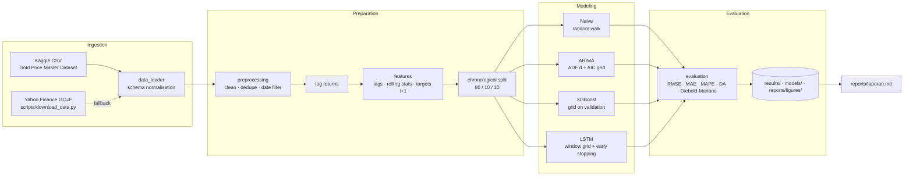

# System Architecture

This document describes how the forecasting system is organised: the data flow, the module boundaries and the
design decisions that keep the evaluation free of look-ahead bias.

## 1. Two entry points, one methodology

| Entry point | File | Audience | Purpose |
|---|---|---|---|
| **Submission notebook** | `notebooks/gold_price_forecasting.py` → `.ipynb` | Dicoding reviewer, readers | Self-contained narrative with text cells for each stage; produces the figures and numbers used in `reports/laporan.md` |
| **Modular pipeline** | `src/` package, `python -m src.pipeline` | Developers | Reusable, unit-tested implementation of the same methodology for re-runs, extensions and automation |

The notebook deliberately does not import `src/`, so it can be uploaded to Colab or reviewed as a single file.
The percent-format `.py` is the single source of truth for both notebook deliverables (`scripts/build_notebook.py`
generates the `.ipynb`). Both entry points share the same splits, features, grids and metrics; if one is changed,
update the other (the unit tests in `tests/` guard the `src/` implementation).

## 2. Data flow

## 3. Module responsibilities (`src/`)

| Module | Responsibility | Key API |
|---|---|---|
| `config.py` | Typed dataclass configuration: paths, date range, split fractions, grids | `Config` |
| `utils.py` | Seeding, device selection, logging, timing | `set_seed`, `get_device`, `timer` |
| `data_loader.py` | Read Kaggle / yfinance / investing-style CSVs into `Date, Open, High, Low, Close[, Volume]`; optional Yahoo download | `read_price_csv`, `download_yahoo`, `resolve_data_path` |
| `preprocessing.py` | Cleaning with a `QualityReport`, ADF test and differencing order, chronological splitting | `clean_prices`, `adf_test`, `select_differencing_order`, `chronological_split` |
| `features.py` | Supervised framing at forecast origin `t`, sliding windows, return→price conversion | `build_feature_frame`, `make_sequences`, `returns_to_price` |
| `models/baseline.py` | Naive random walk | `NaiveForecaster` |
| `models/arima.py` | ARIMA order search on train, one-step-ahead forecasts with frozen parameters | `ArimaForecaster` |
| `models/xgboost_model.py` | XGBoost on features, validation grid search, feature importance | `XGBReturnForecaster` |
| `models/lstm.py` | PyTorch LSTM, early-stopped training, validation grid search, save | `LSTMRegressor`, `LSTMForecaster` |
| `evaluation.py` | Point metrics, directional accuracy, Diebold-Mariano (HLN-corrected) | `compare_models`, `diebold_mariano` |
| `visualization.py` | All figures (EDA, split, predictions, residuals, learning curve, importance) | `plot_*` |
| `pipeline.py` | CLI orchestration and artefact writing | `run`, `main` |

All forecasters expose `predict_close(...)`, returning next-day closing prices aligned with the test origins, so the
evaluation layer is model-agnostic.

## 4. Leakage controls

| Risk | Control |
|---|---|
| Future data in features | Each row is an origin `t`; features use `shift(k ≥ 0)` and trailing rolling windows only. Unit test `test_feature_frame_has_no_lookahead` perturbs future prices and asserts past features are unchanged. |
| Shuffled splits | Train / validation / test are contiguous, time-ordered blocks. |
| Scaler fitted on test data | LSTM mean/std use training-period returns only. |
| ARIMA re-estimated on test data | Parameters are estimated on train; `results.apply()` re-filters the full series with frozen parameters, so the forecast for `t+1` uses data up to `t`. |
| Hyperparameters tuned on test | Grids and early stopping use the validation block; the test block is scored once. |
| Model chosen on test | The best model is the one with the lowest **validation** RMSE; test metrics are only reported. |
| Split boundaries | The last training target is the first validation day's close; the last validation target is the first test day's close, which is only an *input* for test. Test targets start one day later, so no test target is used for training or tuning. |
| Design decisions informed by test data | EDA describes the full dataset, but every modelling decision (returns instead of levels, `d = 1`, no seasonal term) is re-checked on training and validation data only (notebook Section 6.5). |
| Filled or interpolated source rows | Checked: the 83 flat O=H=L=C bars never repeat the previous close, and there is no systematic midpoint interpolation. These are settlement-only days, not values filled from neighbouring days. |
| Extrapolation failure | XGBoost and LSTM predict log returns, not price levels, because the test period trades above the training maximum. |

## 5. Artefacts

| Path | Produced by | Content |
|---|---|---|
| `data/processed/xauusd_clean.csv` | notebook, pipeline | Cleaned daily series with log returns |
| `reports/figures/*.png` | notebook | Figures embedded in the report |
| `reports/figures/pipeline/*.png` | pipeline | Figures from CLI runs (git-ignored) |
| `results/metrics.csv` | notebook, pipeline | Test metrics per model |
| `results/test_predictions.csv` | notebook, pipeline | Actual and predicted next-day closes |
| `results/run_summary.json` | notebook, pipeline | Split periods, selected hyperparameters, best model |
| `results/*_tuning.csv`, `arima_grid_search.csv`, `arima_summary.txt` | pipeline | Full search logs |
| `models/xgboost.json`, `models/lstm.pt` | notebook, pipeline | Trained model weights |

## 6. Hardware profile

Designed for a laptop with an RTX 4050 (6 GB VRAM). About 2,800 daily rows yields ~2,300 training windows; the
largest LSTM (2 layers, 64 units, window 60) has ~50k parameters and uses well under 1 GB of VRAM. ARIMA and XGBoost
run on CPU in seconds. The full notebook completes in a few minutes; `--cpu` makes the LSTM run on CPU if no GPU is present.
