# Laporan Proyek Machine Learning - David Kurniawan

**Judul:** Prediksi Harga Penutupan Emas (XAU/USD) Hari Berikutnya: Perbandingan Naive, ARIMA, XGBoost, dan LSTM

## Domain Proyek

**Domain:** Keuangan dan Ekonomi (*financial time series forecasting*)

### Latar Belakang

Emas memiliki peran unik dalam sistem keuangan global. Emas berfungsi sebagai aset *safe haven* saat pasar saham bergejolak, sebagai lindung nilai (*hedge*) terhadap inflasi dan pelemahan dolar AS, dan sebagai komponen utama cadangan devisa bank sentral. Baur dan Lucey [1] menunjukkan bahwa emas cenderung menjadi *safe haven* bagi pasar saham dalam periode krisis jangka pendek. Karena itu, pergerakan harganya dipantau oleh investor, manajer portofolio, perusahaan tambang, industri perhiasan, dan otoritas moneter.

Di Indonesia, harga emas domestik, misalnya emas batangan yang banyak dibeli masyarakat sebagai instrumen investasi, mengikuti harga emas dunia (XAU/USD) yang dikonversi ke rupiah. Perubahan harga emas global dalam satu hari dapat langsung memengaruhi nilai tabungan emas masyarakat, margin pelaku usaha perhiasan, dan keputusan lindung nilai perusahaan. Relevansinya semakin besar karena harga emas bergerak sangat agresif pada periode data proyek ini: sepanjang tahun kalender 2025 harga emas naik 64,4%, dan pada 30 Januari 2026 turun sekitar 11% dalam satu hari. Prakiraan harga jangka pendek yang andal dapat membantu keputusan-keputusan tersebut.

### Mengapa dan Bagaimana Masalah Ini Harus Diselesaikan

Harga aset keuangan sulit diprediksi. Hipotesis pasar efisien bentuk lemah [8] menyatakan bahwa informasi harga masa lalu sudah tercermin pada harga saat ini, sehingga model *random walk* sering menjadi pembanding yang sulit dikalahkan. Meskipun begitu, banyak penelitian mengklaim bahwa model *machine learning* mampu mengungguli model statistik:

- Ariyo dkk. [2] menunjukkan bahwa ARIMA memiliki potensi kuat untuk prediksi harga saham jangka pendek, dan Xiao dkk. [7] membandingkan ARIMA dan LSTM secara langsung pada 50 saham dengan metrik MAE, MSE, dan RMSE.
- Siami-Namini dan Namin [3], [4] melaporkan bahwa LSTM menurunkan tingkat galat secara drastis dibandingkan ARIMA pada beberapa indeks saham dan data ekonomi.
- Fischer dan Krauss [5] menemukan bahwa LSTM mengungguli *random forest*, *deep neural network*, dan regresi logistik pada saham penyusun S&P 500.
- Sebaliknya, Makridakis dkk. [6], yang menguji 1.045 deret waktu dari kompetisi M3, menemukan bahwa metode statistik lebih akurat daripada metode *machine learning* di semua horizon prakiraan, dengan kebutuhan komputasi yang jauh lebih kecil.

Perbedaan temuan ini menunjukkan bahwa klaim keunggulan model kompleks tidak bisa diterima begitu saja. Klaim tersebut perlu diuji pada data yang spesifik dengan protokol evaluasi yang adil. Proyek ini melakukannya untuk harga emas harian. Model *baseline* (Naive dan ARIMA) dibandingkan dengan model *machine learning* (XGBoost) dan *deep learning* (LSTM) pada periode uji yang sama. Pengujian dilakukan tanpa kebocoran data masa depan, dilengkapi uji signifikansi statistik, dan dijalankan pada perangkat keras kelas laptop (GPU NVIDIA RTX 4050, 6 GB). Dengan demikian, hasilnya bukan hanya "model mana yang paling akurat", tetapi juga "apakah tambahan kompleksitas dan biaya komputasi tersebut sepadan".

## Business Understanding

### Problem Statements

1. Seberapa akurat harga penutupan emas pada hari perdagangan berikutnya dapat diprediksi hanya dari riwayat harganya sendiri?
2. Apakah model *machine learning* (XGBoost) dan *deep learning* (LSTM) memberikan peningkatan akurasi yang **signifikan secara statistik** dibandingkan prakiraan *naive random walk* dan model statistik klasik ARIMA?
3. Model mana yang memberikan keseimbangan terbaik antara akurasi dan biaya komputasi untuk dijalankan secara lokal?

### Goals

1. Membangun *pipeline* prakiraan satu langkah ke depan (*one-step-ahead*) dan mengukur galatnya dalam satuan USD dan persen pada periode uji yang secara kronologis berada setelah data latih.
2. Membandingkan keempat model dengan metrik RMSE, MAE, MAPE, dan akurasi arah, lalu menguji signifikansi perbedaannya terhadap model *naive* dengan uji Diebold-Mariano [11], [12].
3. Mencatat waktu pelatihan dan prediksi setiap model, lalu merekomendasikan model yang paling layak berdasarkan akurasi, signifikansi, dan biaya komputasi.

### Solution Statements

Empat pendekatan diajukan. Semuanya dievaluasi dengan metrik yang sama pada data uji yang sama:

1. **Naive random walk (baseline).** Prakiraan harga besok sama dengan harga hari ini. Model ini adalah tolok ukur wajib untuk harga aset keuangan.
2. **ARIMA(p, d, q).** Orde diferensiasi `d` ditentukan dengan uji *Augmented Dickey-Fuller* (ADF), sedangkan orde `p` dan `q` dipilih melalui *grid search* berdasarkan nilai AIC terkecil.
3. **XGBoost** [10] dengan fitur hasil rekayasa (lag *return*, statistik bergulir, rentang harian). Model ditingkatkan dengan **hyperparameter tuning** (*grid search* pada data validasi dan *early stopping*).
4. **LSTM** [9] pada jendela geser (*sliding window*) *log return* yang distandardisasi. Model ditingkatkan dengan **hyperparameter tuning** pada panjang jendela, jumlah unit tersembunyi, dan jumlah lapisan, dengan *early stopping*.

**Ukuran keberhasilan:** model terbaik dipilih berdasarkan **RMSE pada data validasi**, sehingga data uji tidak pernah dipakai untuk memilih model. Kinerja model terpilih kemudian dilaporkan pada data uji. Model tersebut direkomendasikan menggantikan *baseline* hanya jika perbaikannya terhadap *naive* pada data uji signifikan (p-value Diebold-Mariano < 0,05). Jika tidak signifikan, model yang lebih sederhana dan murah yang direkomendasikan.

## Data Understanding

Dataset yang digunakan adalah data historis harian **harga emas berjangka COMEX (ticker `GC=F`)** dari **Yahoo Finance** [14]. Data diunduh menggunakan pustaka Python `yfinance` [15] dan disimpan sebagai `data/raw/xauusd_daily.csv`.

- **Tautan sumber data:** https://finance.yahoo.com/quote/GC%3DF/history/
- **Cara mengunduh ulang:** notebook mengunduh data secara otomatis pada tahap *Data Loading* jika berkas `data/raw/xauusd_daily.csv` belum ada (ticker `GC=F`, 1 Januari 2015 – 30 April 2026; tanggal akhir bersifat eksklusif). Semua direktori keluaran (`data/raw`, `data/processed`, `reports/figures`, `results`, `models`) dibuat otomatis, sehingga notebook dapat dijalankan ulang di lingkungan baru tanpa berkas tambahan.
- **Tanggal akses:** 17 September 2026
- **Format:** satu berkas CSV, data kuantitatif harian (hanya hari perdagangan)
- **Jumlah data:** **2.847 baris × 6 kolom** (`Date`, `Open`, `High`, `Low`, `Close`, `Volume`)
- **Rentang waktu:** 2 Januari 2015 sampai 29 April 2026
- **Lisensi:** hanya untuk riset dan pendidikan (mengikuti ketentuan Yahoo Finance)

Catatan: `GC=F` adalah kontrak berjangka emas COMEX bulan terdekat (*front-month*). Harganya bergerak sangat dekat dengan harga spot XAU/USD tetapi tidak identik, sehingga pada proyek ini digunakan sebagai proksi harga emas XAU/USD.

### Variabel-variabel pada dataset harga emas Yahoo Finance (GC=F) adalah sebagai berikut:

- **Date** (`datetime64`): tanggal hari perdagangan. Akhir pekan dan hari libur bursa tidak tercatat.
- **Open** (`float64`): harga pembukaan emas pada hari tersebut (USD per troy ounce).
- **High** (`float64`): harga tertinggi selama sesi perdagangan (USD per troy ounce).
- **Low** (`float64`): harga terendah selama sesi perdagangan (USD per troy ounce).
- **Close** (`float64`): harga penutupan (USD per troy ounce). Nilai `Close` pada hari berikutnya menjadi **target prakiraan**.
- **Volume** (`int64`): jumlah kontrak yang diperdagangkan pada hari tersebut.

### Kondisi Data

Pemeriksaan kualitas data pada notebook menghasilkan temuan berikut:

| Pemeriksaan | Hasil |
|---|---|
| Nilai hilang (*missing values*) per kolom | 0 pada semua kolom |
| Tanggal duplikat | 0 |
| Tanggal yang tidak dapat dibaca | 0 |
| Harga `Close` ≤ 0 | 0 |
| Baris OHLC tidak konsisten (High < max(Open, Close) atau Low > min(Open, Close)) | 0 |
| Hari dengan `Volume` = 0 | 35 hari |
| *Bar* datar (`Open` = `High` = `Low` = `Close`) | 83 hari (28 di antaranya juga bervolume nol) |
| *Bar* datar yang `Close`-nya sama dengan hari sebelumnya (indikasi *forward-fill*) | 0 |
| Celah kalender antarbaris | 1 hari: 2.229 kali; 2 hari: 26 kali; 3 hari (akhir pekan): 510 kali; 4 hari (libur panjang): 81 kali. Celah terpanjang 4 hari. Ini wajar untuk data bursa dan **tidak diimputasi**. |

Statistik deskriptif harga penutupan (`Close`): rata-rata 1.863,88 USD, median 1.727,20 USD, simpangan baku 837,29 USD, minimum 1.050,80 USD, dan maksimum 5.318,40 USD.

Terdapat 83 hari dengan *bar* datar (harga pembukaan, tertinggi, terendah, dan penutupan sama). Hari-hari ini tampaknya hanya mencatat harga *settlement* dari sumber data. Harga penutupannya tetap berbeda dari hari sebelumnya, dan tidak ada baris yang harganya persis di tengah-tengah hari sebelum dan sesudahnya secara sistematis. Artinya, baris tersebut **bukan hasil *forward-fill* atau interpolasi** yang dapat membawa informasi dari hari lain (kebocoran data). Baris ini tetap digunakan karena harga penutupannya valid; dampaknya hanya fitur `hl_range` bernilai 0 pada hari tersebut.

Catatan kualitas data lainnya: nilai `Volume` tidak konsisten antarperiode. Median volume harian hanya sekitar 56–195 kontrak pada 2015–2019, tetapi melonjak menjadi sekitar 160.000–208.000 kontrak sejak 2020, ditambah 35 hari bervolume nol. Pola ini menunjukkan perubahan cara pencatatan volume di sumber data, bukan perubahan aktivitas pasar yang sebenarnya. Karena itu, `Volume` **tidak digunakan sebagai fitur** model.

### Exploratory Data Analysis

EDA pada bagian ini **mendeskripsikan seluruh dataset** (2015–2026). Untuk menghindari "mengintip" data uji (*test-set snooping*), tidak ada keputusan pemodelan yang didasarkan pada nilai periode uji. Setiap keputusan desain yang diambil dari EDA diverifikasi ulang **hanya dengan data latih dan validasi** setelah pembagian data (lihat Data Preparation langkah 5).

**1. Tren harga jangka panjang**

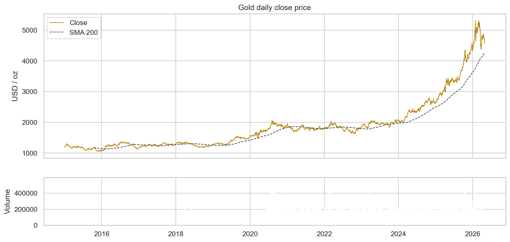

Harga emas menunjukkan tren naik jangka panjang yang semakin curam pada tahun-tahun terakhir: return tahun kalender 2023 sebesar 13,4%, 2024 sebesar 27,5%, dan 2025 sebesar 64,4%. Rata-rata harganya jelas tidak konstan (tidak stasioner), dan harga emas terus mencetak rekor baru. Akibatnya, periode yang lebih baru dapat berada di atas rentang harga periode sebelumnya. Model berbasis pohon dan jaringan saraf yang dilatih langsung pada level harga tidak mampu memprediksi nilai di luar rentang data latih; XGBoost, misalnya, tidak akan pernah memprediksi harga di atas harga maksimum data latih. Temuan ini menjadi dasar keputusan untuk memodelkan ***return***, bukan level harga, pada XGBoost dan LSTM. Keputusan ini dikonfirmasi tanpa data uji: 91,8% harga penutupan pada periode **validasi** sudah berada di atas harga maksimum periode latih (2.093,10 USD).

**2. Distribusi return dan volatilitas**

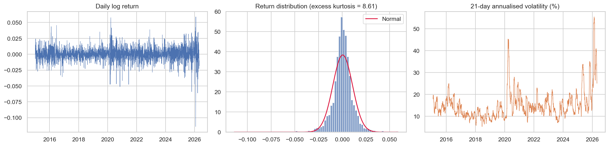

*Log return* harian berfluktuasi di sekitar nol, dengan rata-rata 0,047% dan simpangan baku 1,04% per hari (sekitar 16,5% per tahun). Distribusinya berekor tebal dengan *excess kurtosis* 8,61 dan condong ke kiri (*skewness* −0,62). Uji Jarque-Bera menolak asumsi normalitas (p ≈ 0). Return harian terbesar adalah −11,41% pada 30 Januari 2026 dan +5,89% pada 3 Februari 2026.

Grafik volatilitas bergulir 21 hari menunjukkan pola ***volatility clustering***: lonjakan pada awal 2020 (pandemi COVID-19), lalu lonjakan yang jauh lebih tinggi pada 2025–2026 (di atas 50% per tahun). Volatilitas tahunan periode latih hanya 14,7%, sedangkan periode uji 27,5%, hampir dua kali lipat. Kejadian ekstrem lebih sering muncul daripada yang diasumsikan distribusi normal. Hal ini membesarkan metrik berbasis kuadrat galat, sehingga MAE juga dilaporkan sebagai pelengkap RMSE.

**3. Pola musiman**

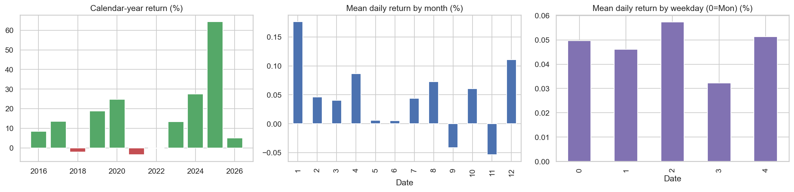

Rata-rata *return* harian per bulan berkisar antara −0,054% (November) dan +0,176% (Januari). Rata-rata per hari dalam seminggu berkisar antara +0,032% dan +0,057%. Semua nilai ini sangat kecil dibandingkan simpangan baku harian sebesar 1,04%, sehingga tidak ada pola musiman kalender yang kuat dan komponen musiman (SARIMA) tidak diperlukan. Fitur hari dalam seminggu tetap diberikan ke XGBoost karena biayanya murah.

**4. Autokorelasi dan stasioneritas**

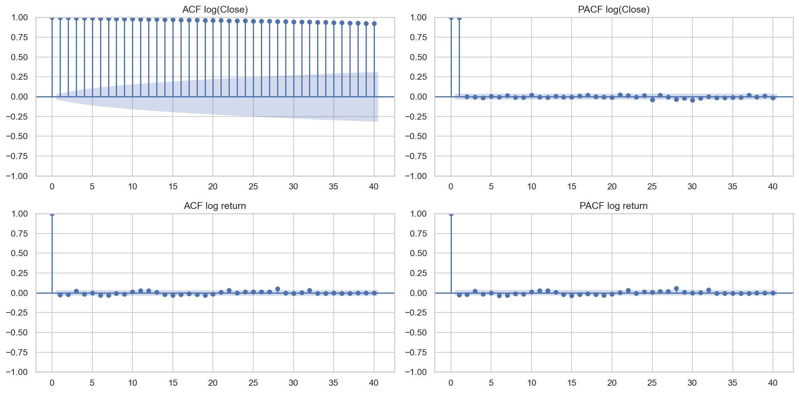

| Deret | Statistik ADF | p-value | Nilai kritis 5% | Stasioner? |
|---|---|---|---|---|
| log(Close) | 1,3250 | 0,9967 | −2,8626 | Tidak |
| log return | −54,8362 | 0,0000 | −2,8626 | Ya |

ACF log harga meluruh sangat lambat, dan uji ADF tidak menolak hipotesis adanya *unit root* (p = 0,9967). Sebaliknya, *log return* sangat stasioner dengan autokorelasi yang hampir seluruhnya berada di dalam batas signifikansi. Hal ini menunjukkan bahwa (i) ARIMA memerlukan diferensiasi orde satu (`d = 1`) dan (ii) harga masa lalu hampir tidak memuat informasi linear tentang perubahan harga besok. Model *naive* diperkirakan menjadi pembanding yang sangat kuat.

## Data Preparation

Tahapan berikut dilakukan **berurutan**, sama persis dengan urutan pada notebook.

### 1. Pembersihan Data (*Data Cleaning*)

Proses yang dilakukan:

1. Menghapus baris dengan tanggal yang tidak dapat di-*parse*.
2. Mengurutkan data berdasarkan tanggal dan menghapus tanggal duplikat (menyimpan catatan terakhir).
3. Menghapus baris dengan `Close` kosong atau ≤ 0.
4. Mengisi `Open`/`High`/`Low` yang kosong dengan nilai `Close` pada hari yang sama.
5. Membatasi data pada periode analisis 1 Januari 2015 sampai 30 April 2026.

**Alasan:** analisis deret waktu mensyaratkan urutan waktu yang benar dan satu observasi per tanggal. Tanggal duplikat atau tidak berurutan akan merusak perhitungan *lag* dan *return*. Harga penutupan adalah target prakiraan, sehingga nilai kosongnya tidak boleh diimputasi karena sama saja dengan mengarang harga. Hari non-perdagangan sengaja **tidak** ditambahkan, sebab prakiraan dilakukan pada urutan hari bursa.

**Hasil:** dataset ini sudah bersih. Tidak ada duplikat maupun harga tidak valid yang dihapus (0 dan 0), sehingga tersisa 2.847 baris (2 Januari 2015 – 29 April 2026). Langkah pembersihan tetap dipertahankan sebagai pengaman agar *pipeline* tetap benar jika data diperbarui.

### 2. Transformasi Log Return

$$r_t = \ln\left(\frac{Close_t}{Close_{t-1}}\right)$$

**Alasan:** *log return* bersifat stasioner (terbukti pada uji ADF), tidak bergantung pada skala harga sehingga periode harga rendah dan tinggi dapat dibandingkan, serta bersifat aditif terhadap waktu. *Log return* menjadi target pelatihan XGBoost dan LSTM. Prakiraan *return* dikonversi kembali menjadi harga dengan $\widehat{Close}_{t+1} = Close_t \cdot e^{\hat r_{t+1}}$. Langkah ini mengatasi masalah ekstrapolasi yang ditemukan saat EDA. Transformasi dan diferensiasi untuk menstabilkan deret waktu merupakan praktik standar dalam prakiraan [13].

### 3. Rekayasa Fitur (*Feature Engineering*) Tanpa Kebocoran Data

Setiap baris adalah **titik asal prakiraan** `t`. Fitur hanya menggunakan informasi yang tersedia pada penutupan hari `t`, sedangkan target adalah nilai hari `t+1`.

| Kelompok fitur | Kolom | Alasan |
|---|---|---|
| *Lag return* | `ret_lag_0` … `ret_lag_9` | menangkap momentum atau pembalikan jangka pendek |
| Rata-rata bergulir *return* | `ret_mean_5/10/20` | arah pergerakan terkini |
| Simpangan baku bergulir *return* | `ret_std_5/10/20` | rezim volatilitas (*volatility clustering*) |
| Rasio harga terhadap SMA | `close_sma_ratio_5/10/20` | jarak harga dari trennya |
| Rentang harian | `hl_range = (High − Low) / Close` | ketidakpastian intrahari |
| Perubahan pembukaan–penutupan | `oc_change = Close / Open − 1` | arah pergerakan intrahari |
| Kalender | `day_of_week` | efek hari dalam seminggu |

Target: `target_return` $= \ln(Close_{t+1}/Close_t)$ dan `target_close` $= Close_{t+1}$. Baris dengan jendela bergulir yang belum lengkap (20 baris pertama) dan baris terakhir (yang tidak memiliki hari berikutnya) dihapus. Hasilnya **22 fitur** dan **2.826 baris** data *supervised*, dengan titik asal prediksi 2 Februari 2015 – 28 April 2026 dan harga target (hari berikutnya) 3 Februari 2015 – 29 April 2026.

```python
out[f"ret_lag_{k}"] = ret.shift(k)                     # hanya data masa lalu / hari ini
out["target_return"] = np.log(close.shift(-1) / close)  # target = hari berikutnya
```

**Alasan:** XGBoost tidak memiliki pemahaman bawaan tentang urutan waktu, sehingga informasi temporal harus diberikan secara eksplisit sebagai fitur. Kebenaran penyelarasan target diverifikasi dengan `assert` di notebook dan dengan *unit test* yang memastikan bahwa mengubah harga masa depan tidak mengubah fitur masa lalu.

### 4. Pembagian Data Secara Kronologis

Setiap baris adalah **titik asal** prediksi `t`, sedangkan harga yang diprediksi (**target**) adalah harga penutupan pada hari perdagangan berikutnya `t+1`. Karena itu, periode titik asal dan periode target dibedakan:

| Subset | Proporsi | Jumlah baris | Periode titik asal (`t`) | Periode target (`t+1`) | Harga penutupan titik asal min–maks (USD) |
|---|---|---|---|---|---|
| Train | 80% | 2.260 | 2 Feb 2015 – 26 Jan 2024 | 3 Feb 2015 – 29 Jan 2024 | 1.050,80 – 2.093,10 |
| Validation | 10% | 282 | 29 Jan 2024 – 12 Mar 2025 | 30 Jan 2024 – 13 Mar 2025 | 2.004,30 – 2.963,20 |
| Test | 10% | 284 | 13 Mar 2025 – 28 Apr 2026 | 14 Mar 2025 – 29 Apr 2026 | 2.973,60 – 5.318,40 |

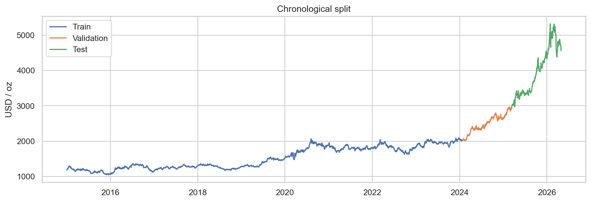

**Alasan:** pengacakan (*shuffle*) pada deret waktu akan membocorkan informasi masa depan ke data latih dan menghasilkan evaluasi yang terlalu optimistis. Data validasi dipakai untuk *hyperparameter tuning* dan *early stopping*. Data uji hanya dipakai **satu kali** untuk perbandingan akhir. Pembagian ini juga aman di batas antar-subset: target terakhir data latih adalah harga 29 Januari 2024 (hari pertama validasi), dan target terakhir data validasi adalah harga 13 Maret 2025, yang pada data uji hanya menjadi *input*. Target data uji dimulai 14 Maret 2025, sehingga tidak ada target uji yang pernah dipakai untuk pelatihan maupun *tuning*.

### 5. Pemeriksaan Keputusan Desain Hanya dengan Data Latih dan Validasi

Karena EDA dilakukan pada seluruh dataset, setiap keputusan desain diuji ulang **tanpa menyentuh data uji**:

| Keputusan | Bukti (hanya data latih/validasi) | Nilai | Kesimpulan |
|---|---|---|---|
| Memodelkan *return*, bukan level harga | Proporsi harga penutupan validasi di atas harga maksimum data latih | 91,8% | Rentang harga sudah terlampaui pada periode validasi |
| Diferensiasi orde satu (`d = 1`) | p-value ADF log(Close) data latih | 0,790 | Tidak stasioner |
| | p-value ADF *log return* data latih | 0,000 | Stasioner |
| Tanpa komponen musiman (tanpa SARIMA) | Rata-rata *return* bulanan terbesar ÷ simpangan baku harian (data latih) | 0,141 | Efek bulanan hanya ~14% dari volatilitas satu hari |
| Sinyal linear lemah | p-value Ljung-Box *return* data latih (lag 10) | 0,325 | Tidak ada autokorelasi signifikan |

**Alasan:** keputusan pemodelan yang diambil setelah melihat data uji dapat membuat hasil evaluasi terlalu optimistis, meskipun kodenya bebas kebocoran. Tabel di atas menunjukkan bahwa semua keputusan desain tetap sama walaupun hanya menggunakan data latih dan validasi.

### 6. Standardisasi (khusus LSTM)

$$z_t = \frac{r_t - \mu_{train}}{\sigma_{train}}$$

Rata-rata ($\mu$ = 0,000233) dan simpangan baku ($\sigma$ = 0,009272) dihitung **hanya dari *return* periode latih**, lalu diterapkan ke data validasi dan uji.

**Alasan:** jaringan saraf berlatih lebih stabil dan cepat konvergen jika inputnya bernilai rata-rata nol dan varians satu. Nilai *return* harian yang sangat kecil (orde 0,01) tanpa standardisasi membuat gradien kecil dan pelatihan lambat. Statistik dihitung dari data latih saja untuk mencegah kebocoran data. XGBoost tidak memerlukan penskalaan karena tidak sensitif terhadap skala fitur, sedangkan ARIMA bekerja langsung pada log harga.

### 7. Pembentukan Jendela Geser (*Sliding Window*, khusus LSTM)

Untuk panjang jendela `W`, input pada titik asal `t` adalah urutan `[z_{t−W+1}, …, z_t]` dengan bentuk `(W, 1)`, dan targetnya adalah `z_{t+1}`. Sebagai contoh, dengan `W = 30` data latih berbentuk `(2.250, 30, 1)`: 2.250 dari 2.260 titik asal memiliki riwayat 30 hari yang lengkap.

**Alasan:** LSTM memerlukan input berbentuk urutan tiga dimensi (`sampel, langkah waktu, fitur`) agar dapat mempelajari ketergantungan temporal secara langsung dari data. Pendekatan jendela *lookback* seperti ini juga digunakan pada studi pembanding ARIMA–LSTM [7].

## Modeling

Keempat model menghasilkan prakiraan harga penutupan hari berikutnya untuk titik asal yang sama pada data uji.

### 1. Naive Random Walk (Baseline)

**Cara kerja:** $\widehat{Close}_{t+1} = Close_t$. Jika harga mengikuti *random walk*, prakiraan terbaik untuk harga besok adalah harga hari ini. Model ini tidak memiliki parameter dan tidak memerlukan pelatihan. RMSE validasi = 24,754.

- **Kelebihan:** tanpa parameter dan tanpa biaya komputasi, sangat kuat untuk harga aset keuangan, dan menjadi batas bawah yang wajib dikalahkan.
- **Kekurangan:** tidak pernah memprediksi arah pergerakan dan selalu terlambat satu hari pada titik balik harga.

### 2. ARIMA

**Cara kerja:** ARIMA(p, d, q) memodelkan deret yang telah didiferensiasi `d` kali sebagai kombinasi linear dari `p` nilai masa lalunya (*autoregressive*) dan `q` galat prakiraan masa lalu (*moving average*). Model dilatih pada log harga, sehingga diferensiasi pertamanya setara dengan *log return*.

**Tahapan dan parameter:**

1. Uji ADF pada data latih menghasilkan `d` = 1.
2. *Grid search* `p ∈ {0, 1, 2, 3}` × `q ∈ {0, 1, 2, 3}` (16 kombinasi) dengan kriteria **AIC** terkecil. AIC dipilih karena menyeimbangkan kecocokan model dan jumlah parameter.
3. Parameter diestimasi **hanya pada data latih**, lalu diterapkan ulang tanpa estimasi ulang ke seluruh deret (`results.apply()`). Dengan cara ini, prakiraan untuk `t+1` hanya menggunakan data sampai `t` (*one-step-ahead*).

**Hasil *grid search* (5 teratas):**

| Orde | AIC | BIC |
|---|---|---|
| **(0, 1, 0)** | **−14.865,04** | **−14.859,31** |
| (0, 1, 1) | −14.863,90 | −14.852,44 |
| (1, 1, 0) | −14.863,89 | −14.852,42 |
| (0, 1, 3) | −14.862,28 | −14.839,36 |
| (3, 1, 0) | −14.862,26 | −14.839,33 |

Orde terpilih adalah **ARIMA(0, 1, 0)** dengan AIC = −14.865,04. Tambahan suku AR atau MA tidak memperbaiki AIC, artinya *return* masa lalu tidak membantu memprediksi *return* berikutnya. ARIMA(0, 1, 0) tanpa konstanta **secara matematis identik dengan *random walk***, sehingga prakiraannya sama dengan model *naive*.

Uji Ljung-Box pada residual menghasilkan p-value 0,394 (lag 5), 0,318 (lag 10), dan 0,131 (lag 20). Semuanya > 0,05, sehingga **tidak ada autokorelasi residual yang tersisa**. Namun residualnya tidak normal (Jarque-Bera = 1.544, kurtosis 7,03), sesuai dengan sifat ekor tebal pada EDA.

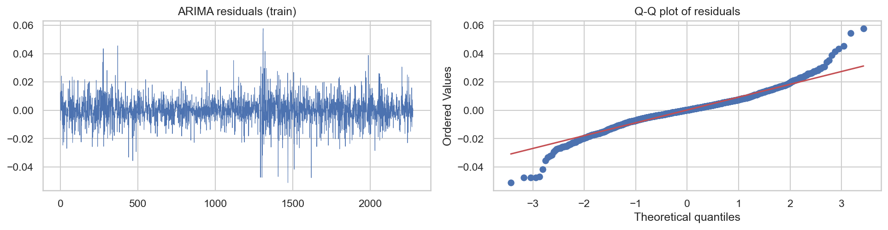

- **Kelebihan:** dasar statistiknya kuat dan dapat diinterpretasikan, cepat dijalankan di CPU, parameternya sedikit, dan efektif untuk data berukuran kecil.
- **Kekurangan:** hanya menangkap hubungan linear, mengasumsikan varians konstan (tidak menangkap *volatility clustering*), dan tidak memanfaatkan variabel eksternal.

### 3. XGBoost

**Cara kerja:** XGBoost [10] membangun *ensemble* pohon regresi secara bertahap (*gradient boosting*). Setiap pohon baru mempelajari sisa galat (residual) dari pohon-pohon sebelumnya, dengan regularisasi untuk mencegah *overfitting*. Model memprediksi `target_return` dari 22 fitur, lalu hasilnya dikonversi menjadi harga.

**Hyperparameter tuning (grid search pada data validasi):**

| Parameter | Nilai yang diuji | Fungsi |
|---|---|---|
| `max_depth` | 2, 3, 5 | kedalaman pohon (kompleksitas interaksi fitur) |
| `learning_rate` | 0,01; 0,05 | besar kontribusi setiap pohon |
| `min_child_weight` | 1, 5 | batas minimum bobot daun (regularisasi) |
| `subsample`, `colsample_bytree` | 0,8 | subsampel baris dan kolom (mengurangi varians) |
| `n_estimators` | maks. 2000, *early stopping* 50 ronde | jumlah pohon |

Sebanyak 12 kombinasi diuji. Kombinasi dengan **RMSE harga validasi** terendah dipilih.

**Hasil:** parameter terbaik `max_depth` = 5, `learning_rate` = 0,05, `min_child_weight` = 1, dengan `best_iteration` = 30. Nilai `best_iteration` pada XGBoost menggunakan indeks yang dimulai dari nol, sehingga model terpilih memprediksi menggunakan **31 *boosting rounds*** (31 pohon). RMSE validasi = 24,674, dengan waktu *tuning* total 1,24 detik. Pada 8 kombinasi teratas, *early stopping* berhenti sangat awal (4–43 *boosting rounds*), dan RMSE validasinya hanya berkisar 24,674–24,692. Artinya, *hyperparameter* hampir tidak berpengaruh karena model tidak menemukan pola yang kuat untuk dipelajari.

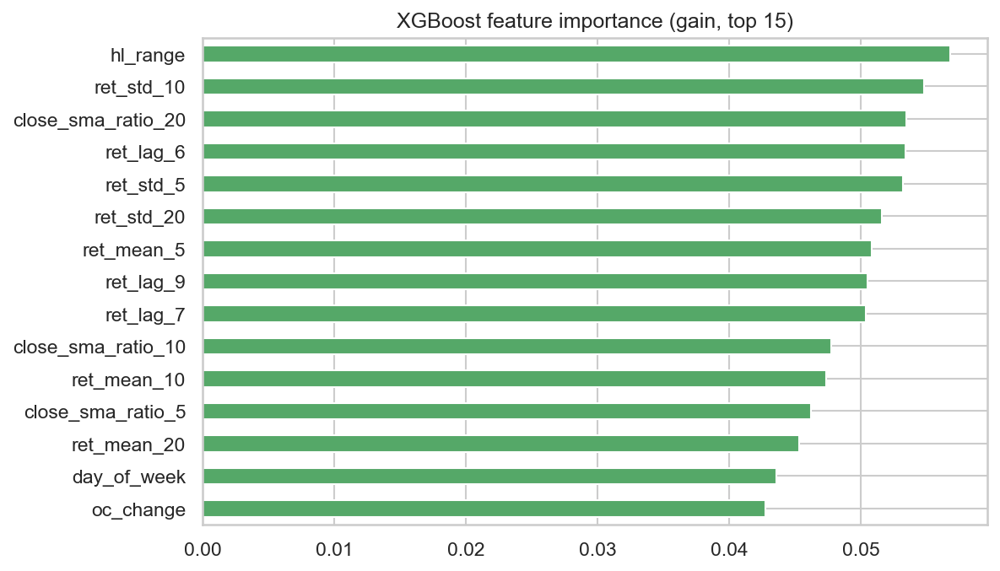

Tiga fitur terpenting adalah `hl_range` (0,057), `ret_std_10` (0,055), dan `close_sma_ratio_20` (0,053), diikuti `ret_lag_6` dan `ret_std_5`. Fitur yang berkaitan dengan volatilitas sedikit lebih informatif daripada lag *return* individual. Namun nilai kepentingannya hampir merata (pembagian merata untuk 22 fitur adalah 0,045), sehingga tidak ada satu fitur pun yang dominan. Ini konsisten dengan temuan EDA bahwa *return* masa lalu memuat sangat sedikit informasi prediktif.

- **Kelebihan:** mampu menangkap hubungan non-linear dan interaksi antarfitur, tahan terhadap perbedaan skala fitur, cepat di CPU, dan menyediakan *feature importance* untuk interpretasi.
- **Kekurangan:** tidak dapat mengekstrapolasi di luar rentang target data latih (diatasi dengan memprediksi *return*), memerlukan rekayasa fitur manual, dan tidak memahami urutan waktu secara bawaan.

### 4. LSTM

**Cara kerja:** LSTM [9] adalah jaringan saraf rekuren yang memproses urutan data langkah demi langkah. *Cell state* dan tiga gerbangnya (*input*, *forget*, *output*) menentukan informasi yang disimpan, dilupakan, atau dikeluarkan. Mekanisme ini mengatasi masalah *vanishing gradient* pada RNN biasa sehingga ketergantungan jangka panjang dapat dipelajari.

**Arsitektur:**

```python
class LSTMRegressor(nn.Module):
    def __init__(self, hidden_size=32, num_layers=1, dropout=0.2):
        super().__init__()
        self.lstm = nn.LSTM(1, hidden_size, num_layers=num_layers, batch_first=True,
                            dropout=dropout if num_layers > 1 else 0.0)
        self.dropout = nn.Dropout(dropout)
        self.head = nn.Linear(hidden_size, 1)   # prediksi return standar hari berikutnya
```

**Parameter pelatihan:** optimizer Adam (*learning rate* 0,001), *loss* MSE, *batch size* 64, *dropout* 0,2, *gradient clipping* (norm 1,0), maksimum 100 *epoch*, dan ***early stopping*** dengan *patience* 10 berdasarkan *loss* validasi (bobot terbaik dipulihkan). Pelatihan dijalankan di GPU NVIDIA GeForce RTX 4050 Laptop.

**Hyperparameter tuning (grid search pada data validasi):** panjang jendela `W ∈ {30, 60}` × unit tersembunyi `H ∈ {32, 64}` × jumlah lapisan `L ∈ {1, 2}`, sehingga ada 8 konfigurasi. Ukuran model sengaja dibuat kecil karena data latih hanya sekitar 2.250 sampel.

| W | H | L | Epoch | *Loss* validasi terbaik | RMSE validasi |
|---|---|---|---|---|---|
| **30** | **64** | **2** | **12** | **1,0985** | **24,584** |
| 60 | 64 | 2 | 11 | 1,0986 | 24,587 |
| 60 | 64 | 1 | 39 | 1,1008 | 24,596 |
| 30 | 64 | 1 | 12 | 1,1008 | 24,606 |
| 30 | 32 | 2 | 12 | 1,1025 | 24,626 |
| 30 | 32 | 1 | 28 | 1,1034 | 24,630 |
| 60 | 32 | 1 | 22 | 1,1036 | 24,631 |
| 60 | 32 | 2 | 11 | 1,1049 | 24,650 |

**Hasil:** konfigurasi terbaik W = 30, H = 64, L = 2, dengan RMSE validasi 24,584. Total waktu *tuning* 8 konfigurasi adalah 17,87 detik di GPU.

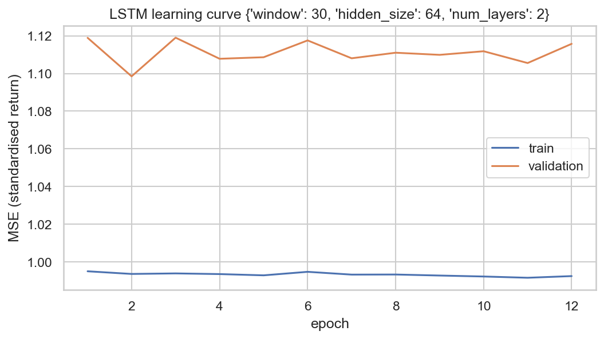

Kurva pembelajaran menunjukkan *loss* validasi terendah sudah tercapai pada *epoch* ke-2. Setelah itu *loss* validasi hanya berfluktuasi di sekitar 1,10–1,12 tanpa perbaikan, sehingga *early stopping* menghentikan pelatihan pada *epoch* ke-12. *Loss* latih juga nyaris datar di sekitar 0,99, yaitu hampir sama dengan varians *return* terstandardisasi (1,0). Artinya, jaringan praktis hanya mempelajari rata-rata *return* dan **tidak menemukan pola temporal yang dapat dipelajari**. Hal ini terlihat pada prakiraannya di data uji: prakiraan *return* LSTM selalu positif (100% hari diprediksi naik) dengan rata-rata 0,060% dan simpangan baku hanya 0,017%. Dengan kata lain, LSTM berperilaku seperti *random walk* dengan sedikit *drift* naik. *Loss* validasi yang lebih besar dari 1 juga mencerminkan bahwa periode validasi lebih volatil daripada periode latih yang dipakai untuk standardisasi.

- **Kelebihan:** mempelajari ketergantungan temporal non-linear langsung dari urutan data tanpa rekayasa *lag* manual, dan fleksibel untuk dikembangkan ke data multivariat.
- **Kekurangan:** membutuhkan banyak data, jumlah parameternya besar relatif terhadap ukuran data (rawan *overfitting*), sensitif terhadap inisialisasi dan *hyperparameter*, paling lambat dilatih, dan paling sulit diinterpretasikan.

### Pemilihan Model Terbaik

Model terbaik dipilih berdasarkan **RMSE pada data validasi**, bukan data uji. Memilih model berdasarkan data uji akan membuat kinerja model terpilih terlihat lebih baik daripada yang sebenarnya (*selection bias*), karena data uji ikut dipakai untuk memilih. Kinerja model terpilih kemudian dilaporkan pada data uji, dan model tersebut hanya direkomendasikan jika perbaikannya terhadap *naive* **signifikan** menurut uji Diebold-Mariano (p < 0,05). Jika tidak ada model yang lolos syarat tersebut, model yang paling sederhana dan murah direkomendasikan. Alasannya, tambahan kompleksitas yang tidak menghasilkan perbaikan nyata hanya menambah biaya komputasi, perawatan, dan risiko *overfitting*.

| Model | RMSE validasi | Peringkat |
|---|---|---|
| LSTM | 24,584 | 1 |
| XGBoost | 24,674 | 2 |
| ARIMA(0, 1, 0) | 24,754 | 3 (identik dengan Naive) |
| Naive | 24,754 | 3 |

- **Model terpilih berdasarkan validasi: LSTM** (RMSE validasi 24,584). Pada data uji, LSTM mencapai RMSE 75,65, hanya 0,20% lebih baik daripada *naive* (75,81), dan **tidak signifikan** (p = 0,338). XGBoost memang memiliki RMSE uji sedikit lebih rendah (75,55), tetapi hal ini tidak dipakai untuk memilih model; selisih keduanya pun tidak berarti.
- **Model yang direkomendasikan: Naive random walk** (setara dengan ARIMA(0, 1, 0) yang terpilih secara AIC). Tidak ada model yang lebih baik secara signifikan, dan model *naive* memberikan akurasi yang praktis setara (selisih RMSE < 0,4%) tanpa pelatihan, tanpa *hyperparameter*, dan tanpa biaya komputasi. Jika tetap dibutuhkan model statistik formal, misalnya untuk interval prakiraan, ARIMA(0, 1, 0) adalah pilihan yang tepat.

## Evaluation

### Metrik Evaluasi

Proyek ini merupakan masalah **regresi deret waktu**. Karena itu, metrik yang digunakan mengukur besar galat prakiraan harga, ditambah satu metrik arah dan satu uji signifikansi. Notasi: $y_i$ adalah harga penutupan aktual hari berikutnya, $\hat y_i$ adalah harga prakiraan, dan $n$ adalah jumlah hari uji (284).

**1. Root Mean Squared Error (RMSE), metrik utama**

$$RMSE = \sqrt{\frac{1}{n}\sum_{i=1}^{n}(y_i - \hat y_i)^2}$$

Setiap galat dikuadratkan, dirata-ratakan, lalu diakarkan, sehingga hasilnya kembali dalam satuan USD/oz. Kuadrat memberi penalti lebih besar pada galat besar. Sifat ini relevan untuk manajemen risiko, karena satu kesalahan prakiraan yang besar lebih merugikan daripada beberapa kesalahan kecil. RMSE validasi digunakan untuk **memilih** model, sedangkan RMSE uji digunakan untuk **melaporkan** kinerjanya.

**2. Mean Absolute Error (MAE)**

$$MAE = \frac{1}{n}\sum_{i=1}^{n}|y_i - \hat y_i|$$

MAE adalah rata-rata besar galat absolut dalam USD/oz, yaitu "rata-rata meleset berapa dolar". MAE lebih tahan terhadap *outlier* daripada RMSE. Jika RMSE jauh lebih besar dari MAE, berarti ada beberapa hari dengan galat sangat besar, yang konsisten dengan distribusi *return* berekor tebal pada EDA.

**3. Mean Absolute Percentage Error (MAPE)**

$$MAPE = \frac{100\%}{n}\sum_{i=1}^{n}\left|\frac{y_i - \hat y_i}{y_i}\right|$$

MAPE adalah galat relatif dalam persen. Metrik ini tidak bergantung pada skala sehingga mudah dipahami pemangku kepentingan dan dapat dibandingkan antarperiode harga. MAPE aman digunakan karena harga emas selalu positif dan jauh dari nol.

**4. Akurasi Arah (*Directional Accuracy*)**

$$DA = \frac{100\%}{n}\sum_{i=1}^{n}\mathbb{1}\left[\operatorname{sign}(\hat y_i - Close_t) = \operatorname{sign}(y_i - Close_t)\right]$$

DA adalah persentase hari ketika model memprediksi arah naik atau turun dengan benar. Metrik ini relevan untuk keputusan beli atau jual. Nilai 50% setara dengan tebakan acak. Model *naive* dan ARIMA(0, 1, 0) tidak memiliki nilai DA karena tidak pernah memprediksi perubahan.

**5. Uji Diebold-Mariano (DM)** [11], [12]

Untuk dua prakiraan A dan B, didefinisikan selisih *loss* $d_i = (y_i - \hat y^A_i)^2 - (y_i - \hat y^B_i)^2$. Statistik ujinya adalah:

$$DM = \frac{\bar d}{\sqrt{\hat\sigma^2_d / n}}$$

Statistik ini dikoreksi dengan faktor Harvey-Leybourne-Newbold untuk sampel kecil, lalu dibandingkan dengan distribusi *t*. Hipotesis nol menyatakan bahwa kedua model sama akurat. Nilai DM negatif berarti model A memiliki galat lebih kecil daripada *naive*, dan **p-value < 0,05** berarti perbedaan akurasinya signifikan secara statistik. Uji ini diperlukan karena selisih RMSE yang kecil bisa saja hanya kebetulan pada periode uji tertentu.

### Hasil Evaluasi pada Data Uji

Periode uji: titik asal prediksi 13 Maret 2025 – 28 April 2026, dengan harga yang diprediksi (target) pada 14 Maret 2025 – 29 April 2026 (284 prakiraan *one-step-ahead*). Grafik prakiraan di bawah menampilkan setiap prakiraan pada **tanggal target**-nya. Tabel diurutkan berdasarkan RMSE validasi (kriteria pemilihan model). Kolom waktu dapat sedikit berbeda di setiap eksekusi; nilai akurasi tetap sama karena *seed* dikunci.

| Model | RMSE Val | RMSE Test | MAE Test | MAPE Test (%) | Akurasi Arah (%) | Δ RMSE vs Naive (%) | Statistik DM | p-value DM | Waktu (s) |
|---|---|---|---|---|---|---|---|---|---|
| **LSTM (terpilih)** | **24,584** | 75,653 | **49,603** | **1,207** | 56,38 | −0,20 | −0,960 | 0,338 | 17,87 |
| XGBoost | 24,674 | **75,545** | 49,759 | 1,209 | **57,45** | −0,35 | −0,278 | 0,781 | 1,24 |
| ARIMA(0, 1, 0) | 24,754 | 75,808 | 49,816 | 1,212 | – | 0,00 | 0,027* | 0,979 | 4,40 |
| Naive | 24,754 | 75,808 | 49,816 | 1,212 | – | 0,00 | – | – | 0,0001 |

\* Statistik DM ARIMA(0, 1, 0) tidak tepat nol hanya karena pembulatan numerik saat transformasi log/eksponensial; prakiraannya identik dengan *naive*.

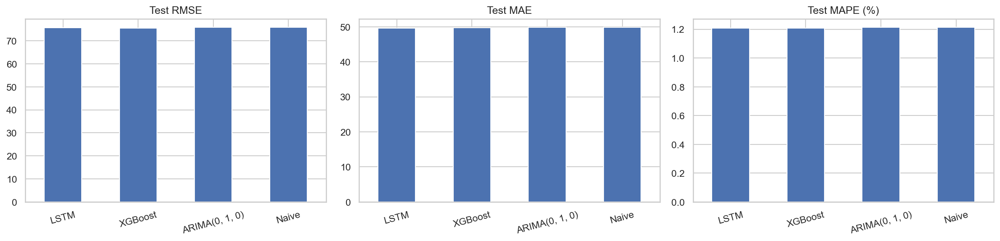

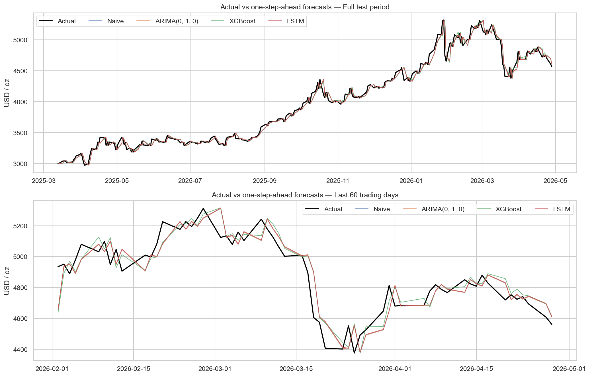

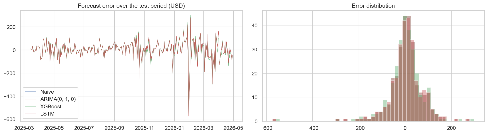

### Pembahasan dan Jawaban atas Problem Statements

**Problem statement 1: seberapa akurat harga emas besok dapat diprediksi?**
Model terpilih (LSTM) mencapai RMSE 75,65 USD, MAE 49,60 USD, dan MAPE 1,21% pada periode uji; semua model lain berada dalam rentang 0,4% dari angka tersebut. Artinya, rata-rata prakiraan meleset sekitar 1,2% dari harga aktual, atau sekitar 50 USD per ounce. Angka ini hampir persis sama dengan besarnya pergerakan harga harian itu sendiri: simpangan baku perubahan harga harian pada periode uji adalah 75,81 USD dan rata-rata perubahan absolutnya 49,83 USD. Jadi hampir seluruh galat berasal dari kejutan harga yang memang tidak dapat diprediksi. Galat terbesar muncul pada hari-hari kejutan pasar, misalnya penurunan tajam 30 Januari 2026 (galat sekitar 573 USD) dan pertengahan Maret 2026. Grafik prakiraan menunjukkan bahwa semua model mengikuti harga aktual dengan jeda sekitar satu hari, pola khas pasar yang mendekati *random walk*.

RMSE uji (~75) jauh lebih besar daripada RMSE validasi (~24,7) bukan karena *overfitting*, sebab model *naive* yang tidak dilatih pun mengalami lonjakan yang sama. Penyebabnya adalah kondisi pasar. Dibandingkan periode validasi, rata-rata harga emas pada periode uji sekitar 1,6 kali lebih tinggi dan volatilitas tahunannya hampir dua kali lipat (27,5% vs 15,4%), sehingga simpangan baku perubahan harga harian dalam dolar naik sekitar tiga kali lipat (75,81 USD vs 24,48 USD). MAPE (1,21%) lebih tepat untuk membandingkan tingkat akurasi antarperiode.

**Problem statement 2: apakah XGBoost dan LSTM signifikan lebih baik daripada naive dan ARIMA?**
**Tidak.** XGBoost dan LSTM hanya menurunkan RMSE sebesar 0,35% dan 0,20% dibanding *naive*, dengan p-value DM masing-masing 0,781 dan 0,338 (jauh di atas 0,05). Perbedaan tersebut tidak signifikan secara statistik dan dapat terjadi secara kebetulan. ARIMA memilih orde (0, 1, 0) yang identik dengan *random walk*.

Akurasi arah juga perlu dibaca dengan hati-hati. XGBoost (57,45%) dan LSTM (56,38%) tampak lebih baik dari 50%, tetapi 56,0% hari pada periode uji memang merupakan hari naik karena emas sedang dalam tren naik kuat. LSTM memprediksi "naik" pada 100% hari, sehingga akurasi arahnya hanya mencerminkan proporsi hari naik tersebut, bukan kemampuan prediktif. XGBoost hanya unggul 1,4 poin persentase dari strategi sederhana "selalu tebak naik".

Temuan ini konsisten dengan hipotesis pasar efisien bentuk lemah [8], dengan hasil EDA (tidak ada autokorelasi berarti pada *return*), dan dengan Makridakis dkk. [6]. Hasil ini tidak mendukung klaim keunggulan besar LSTM [3], [4] untuk kasus harga emas harian univariat.

**Problem statement 3: model dengan keseimbangan akurasi dan biaya terbaik**
Naive tidak memerlukan pelatihan (0,0001 detik). XGBoost selesai dalam 1,24 detik untuk 12 kombinasi *tuning* di CPU, ARIMA dalam 4,40 detik untuk 16 kombinasi orde, dan LSTM dalam 17,87 detik untuk 8 konfigurasi di GPU. LSTM, model yang terpilih berdasarkan validasi, membutuhkan waktu sekitar 14 kali XGBoost dan 4 kali ARIMA, serta memerlukan GPU, tanpa peningkatan akurasi yang signifikan. Karena tidak ada peningkatan signifikan, **model *naive random walk* (setara ARIMA(0, 1, 0)) direkomendasikan** untuk prakiraan titik harga emas harian. XGBoost dan LSTM baru layak dipertimbangkan jika diberi informasi tambahan di luar riwayat harga emas itu sendiri.

### Dampak terhadap Business Understanding

- **Goal 1 tercapai:** *pipeline one-step-ahead* yang bebas kebocoran data berhasil dibangun dan dievaluasi pada 284 hari perdagangan yang tidak pernah dilihat saat pelatihan maupun *tuning*. Galat prakiraan terukur sebesar ~50 USD (MAE) atau ~1,2% (MAPE).
- **Goal 2 tercapai:** keempat solusi dipilih dan di-*tuning* dengan data validasi, lalu dibandingkan dengan metrik yang sama pada data uji dan diuji signifikansinya. Setiap *solution statement* terukur dengan jelas, dan hasilnya menjawab pertanyaan penelitian secara tegas: model kompleks tidak mengungguli *random walk* secara signifikan.
- **Goal 3 tercapai:** biaya komputasi dicatat, dan rekomendasi model didasarkan pada akurasi, signifikansi, dan biaya, bukan akurasi semata.

Bagi pemangku kepentingan, misalnya investor emas atau pelaku usaha perhiasan, implikasinya adalah bahwa riwayat harga saja tidak cukup untuk memperoleh keunggulan prakiraan harian. Upaya yang lebih bernilai adalah mengelola risiko terhadap pergerakan harian ~1–2% (dan sesekali jauh lebih besar, seperti −11% pada 30 Januari 2026), bukan mengandalkan prediksi titik harga besok.

**Keterbatasan dan pengembangan selanjutnya:** model hanya menggunakan riwayat harga emas (univariat) dan satu periode uji yang kebetulan sangat volatil. Pengembangan berikutnya dapat menambahkan variabel makro seperti indeks dolar AS, imbal hasil riil obligasi AS, VIX, dan pembelian emas bank sentral. Pengembangan lain meliputi *rolling-origin backtesting*, prakiraan interval dan volatilitas (misalnya GARCH), serta prakiraan harga emas dalam rupiah untuk konteks pasar Indonesia.

## Referensi

[1] D. G. Baur and B. M. Lucey, "Is gold a hedge or a safe haven? An analysis of stocks, bonds and gold," *The Financial Review*, vol. 45, no. 2, pp. 217–229, 2010, doi: 10.1111/j.1540-6288.2010.00244.x.

[2] A. A. Ariyo, A. O. Adewumi, and C. K. Ayo, "Stock price prediction using the ARIMA model," in *Proc. 2014 UKSim-AMSS 16th Int. Conf. Computer Modelling and Simulation*, Cambridge, UK, 2014, pp. 106–112, doi: 10.1109/UKSim.2014.67.

[3] S. Siami-Namini and A. S. Namin, "Forecasting economics and financial time series: ARIMA vs. LSTM," arXiv:1803.06386, 2018.

[4] S. Siami-Namini, N. Tavakoli, and A. S. Namin, "A comparison of ARIMA and LSTM in forecasting time series," in *Proc. 17th IEEE Int. Conf. Machine Learning and Applications (ICMLA)*, Orlando, FL, USA, 2018, pp. 1394–1401, doi: 10.1109/ICMLA.2018.00227.

[5] T. Fischer and C. Krauss, "Deep learning with long short-term memory networks for financial market predictions," *European Journal of Operational Research*, vol. 270, no. 2, pp. 654–669, 2018, doi: 10.1016/j.ejor.2017.11.054.

[6] S. Makridakis, E. Spiliotis, and V. Assimakopoulos, "Statistical and machine learning forecasting methods: Concerns and ways forward," *PLOS ONE*, vol. 13, no. 3, e0194889, 2018, doi: 10.1371/journal.pone.0194889.

[7] R. Xiao, Y. Feng, L. Yan, and Y. Ma, "Predict stock prices with ARIMA and LSTM," arXiv:2209.02407, 2022.

[8] E. F. Fama, "Efficient capital markets: A review of theory and empirical work," *The Journal of Finance*, vol. 25, no. 2, pp. 383–417, 1970, doi: 10.2307/2325486.

[9] S. Hochreiter and J. Schmidhuber, "Long short-term memory," *Neural Computation*, vol. 9, no. 8, pp. 1735–1780, 1997, doi: 10.1162/neco.1997.9.8.1735.

[10] T. Chen and C. Guestrin, "XGBoost: A scalable tree boosting system," in *Proc. 22nd ACM SIGKDD Int. Conf. Knowledge Discovery and Data Mining*, San Francisco, CA, USA, 2016, pp. 785–794, doi: 10.1145/2939672.2939785.

[11] F. X. Diebold and R. S. Mariano, "Comparing predictive accuracy," *Journal of Business & Economic Statistics*, vol. 13, no. 3, pp. 253–263, 1995, doi: 10.1080/07350015.1995.10524599.

[12] D. Harvey, S. Leybourne, and P. Newbold, "Testing the equality of prediction mean squared errors," *International Journal of Forecasting*, vol. 13, no. 2, pp. 281–291, 1997, doi: 10.1016/S0169-2070(96)00719-4.

[13] R. J. Hyndman and G. Athanasopoulos, *Forecasting: Principles and Practice*, 3rd ed. Melbourne, Australia: OTexts, 2021. [Online]. Available: https://otexts.com/fpp3/

[14] Yahoo Finance, "Gold Futures (GC=F) historical data," Yahoo Finance. [Online]. Available: https://finance.yahoo.com/quote/GC%3DF/history/ (accessed Sep. 17, 2026).

[15] R. Aroussi, "yfinance: Download market data from Yahoo! Finance's API," GitHub repository. [Online]. Available: https://github.com/ranaroussi/yfinance

**---Ini adalah bagian akhir laporan---**
